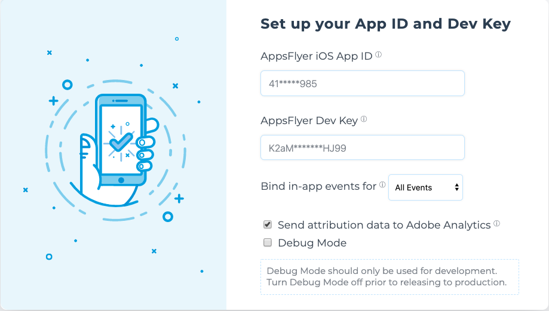

# appsflyer-adobe-mobile-ios-extension

🛠 In order for us to provide optimal support, we would kindly ask you to submit any issues to support@appsflyer.com

> *When submitting an issue please specify your AppsFlyer sign-up (account) email , your app ID , production steps, logs, code snippets and any additional relevant information.*

## Table of content

- [Adding the SDK to your project](#add-sdk-to-project)
- [Initializing the SDK](#init-sdk)
- [Guides](#guides)
- [API](#api) 
- [Data Elements](#data-elements)
- [Swift Example](#swift-example)


### <a id="plugin-build-for"> This plugin is built for
    
- iOS AppsFlyer SDK **v6.1.1**

## <a id="add-sdk-to-project"> 📲 Adding the SDK to your project

Add the following to your app's `Podfile`:

```javascript
	pod 'AppsFlyerAdobeExtension', '6.1.1'
```

## <a id="init-sdk"> 🚀 Initializing the SDK
    
Register the AppsFlyer extension from your `Application` class, alongside the Adobe SDK initialisation code: 
```objc
...
#import "AppsFlyerAdobeExtension/AppsFlyerAdobeExtension.h"

@implementation AppDelegate


- (BOOL)application:(UIApplication *)application didFinishLaunchingWithOptions:(NSDictionary *)launchOptions {
    [ACPCore configureWithAppId:@"Key"];
    ...
    [AppsFlyerAdobeExtension registerExtension];
    ...
    
    [AppsFlyerAdobeExtension registerCallbacks:^(NSDictionary *dictionary) {
        NSLog(@"[AppsFlyerAdobeExtension] Received callback: %@", dictionary);
        if([[dictionary objectForKey:@"callback_type"] isEqualToString:@"onConversionDataReceived"]){
            if([[dictionary objectForKey:@"is_first_launch"] boolValue] == YES){
                NSString* af_status = [dictionary objectForKey:@"af_status"];
                if([af_status isEqualToString:@"Non-organic"]){
                    NSLog(@"this is first launch and a non organic install!");
                }
            }
        } else if([[dictionary objectForKey:@"callback_type"] isEqualToString:@"onAppOpenAttribution"]) {
            NSLog(@"onAppOpenAttribution Received");
        }
     }];

    [AppsFlyerAdobeExtension callbacksErrorHandler:^(NSError *error) {
          NSLog(@"[AppsFlyerAdobeExtension] Error receivng callback: %@" , error);
      }];
    
    return YES;
}

```

In Addition to adding the init code, the settings inside the launch dashboard must be set.



| Setting  | Description   |
| -------- | ------------- |
| AppsFlyer iOS App ID      | Your iTunes [application ID](https://support.appsflyer.com/hc/en-us/articles/207377436-Adding-a-new-app#available-in-the-app-store-google-play-store-windows-phone-store)  (required for iOS only)  |
| AppsFlyer Dev Key   | Your application [devKey](https://support.appsflyer.com/hc/en-us/articles/211719806-Global-app-settings-#sdk-dev-key) provided by AppsFlyer (required)  |
| Bind in-app events for    | Bind adobe event to appsflyer in-app events. For more info see the doc [here](/docs/Guides.md#events). |
| Send attribution data    | Send conversion data from the AppsFlyer SDK to adobe. This is required for data elements. |
| Debug Mode    | Debug mode - set to `true` for testing only.  |

> Note: For Send attribution data, use this feature if you are only working with ad networks that allow sharing user level data with 3rd party tools.

## <a id="guides"> 📖 Guides

- [Deep Linking](/docs/Guides.md#deeplinking)
- [In-App Events](/docs/Guides.md#events)
- [Data Elements](/docs/Guides.md#data-elements)
- [Attribution Data tracking with Adobe Analytics](/docs/Guides.md#attr-data)
- [Deeplink Data tracking with Adobe Analytics](/docs/Guides.md#deeplink-data)

## <a id="api"> 📑 API
  
See the full [API](/docs/API.md) available for this plugin.


## <a id="data-elements"> 📂 Data Elements
  
Check out the available data elements [here](/docs/DataElements.md).

## <a id="swift-example"> Swift Example
  
See the Swift Example [here](/docs/SwiftExample.md).
